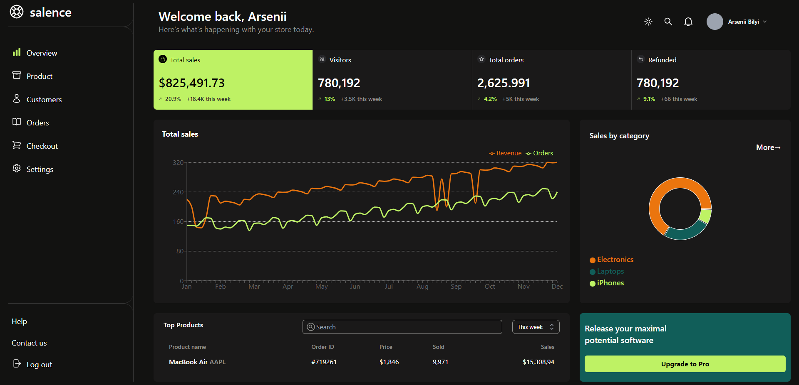
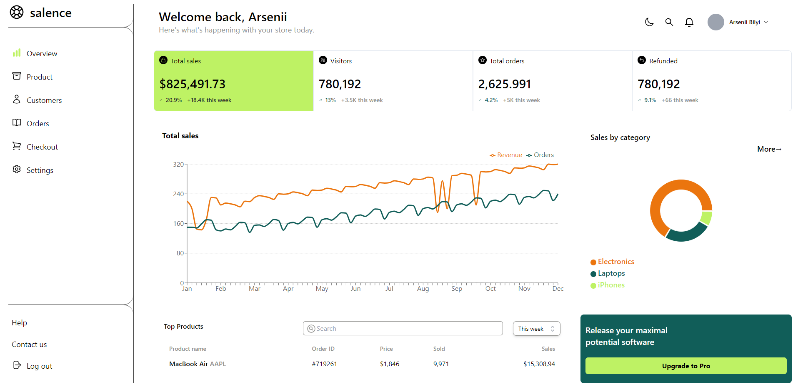
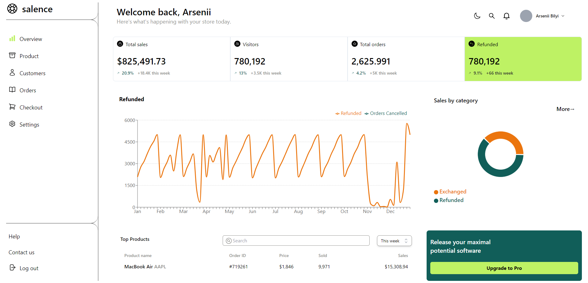

# Salence Design Reproducing

### This site is made by [the design from Dribbble](https://dribbble.com/shots/22143278-Salence-E-commerce-Analytics-Web-App) as a work of **Arsenii Bilyi**.

### [**GITHUB PAGES VERSION**](https://atryknaav.github.io/salence-profile/)

## Screenshots

## Features

- React Native
- Working with components
- TypeScript
- Tailwind CSS
- Using external packages
- Using hooks and states
- Avoiding prop drilling by using state managers (Jotai)
- Dark/Light theme change on button click (the theme is defaultly set to the system's preferable one)
- SVG Work
- Using data from a data base

## In Process

Currently, there is multiplatform capability being developed
